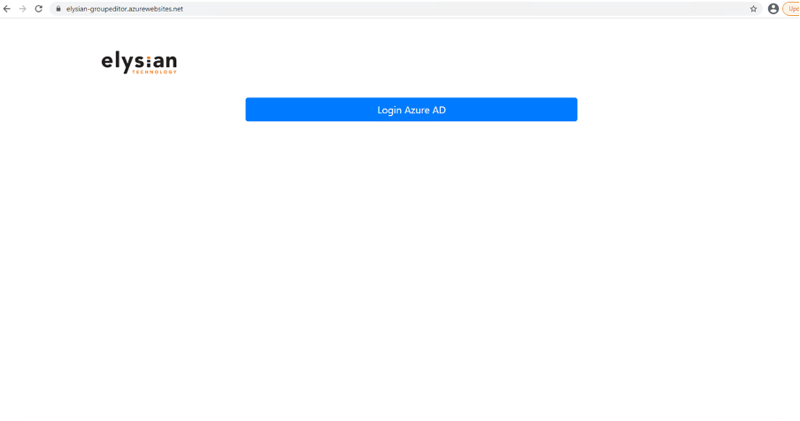
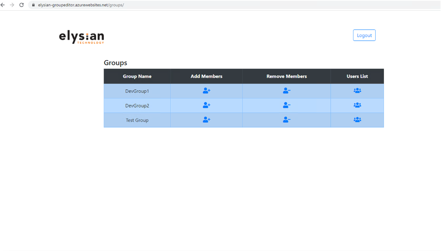
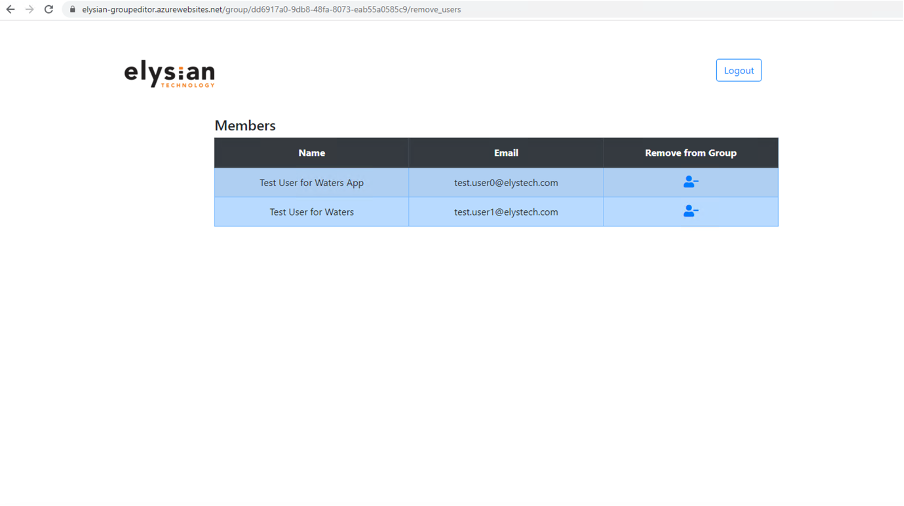
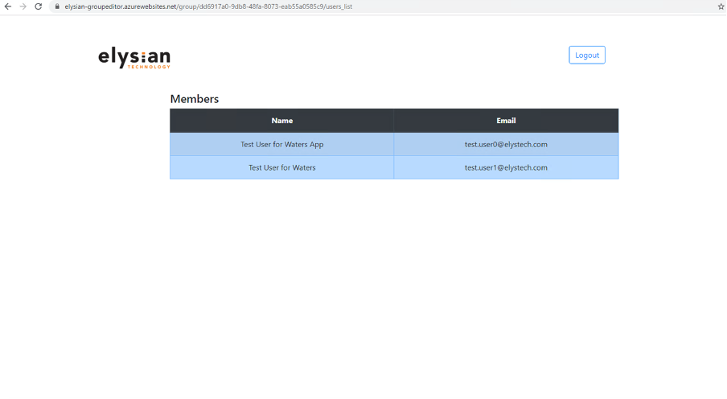
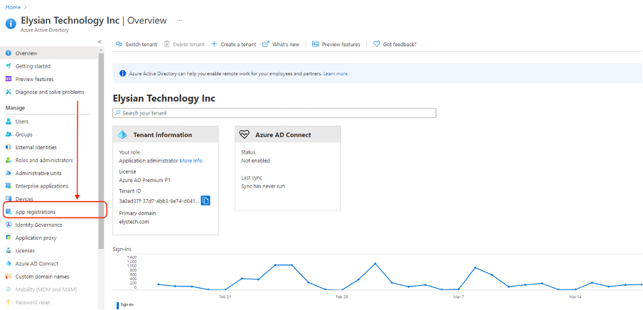
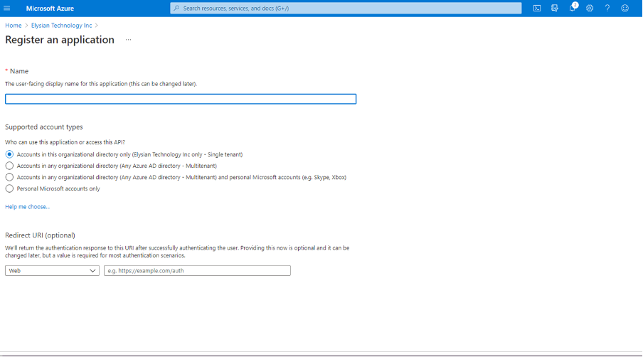

Elysian Group Editor

These Azure Services we use:

•	Azure Web App
•	Azure AD
•	Azure Application for SSO
•	Python Django

Application Overview
Home Page:

 
Azure AD is used for user SSO. A popup window will be opened after clicking button. Once user will be login, it will be redirected to see the whole groups against Logedin user.
User will be login once per session, will not be asked for login again. 

Groups List:
 

User will be given options:
1.	Group List
2.	Add Members against a specific Group
3.	Remove Members against a group
4.	List of Users which are already part of Group.
5.	Logout button if users want to. 

Add Membership:
 User can select specific user to add as a member in group and also search user by Display Name is added.
At the bottom it is pagination. 

Remover Membership:
 
User can select specific member to remove from the group.

Members List:
 

Users’ member list will be shown on this page.

Azure Application for SSO
We have to register an application for SSO in Azure AD, select App registration
 

Click New registration and select internal tenant only and give redirect URL 

We have to get 

1.	Client ID
2.	Tenant ID
3.	Client Secret

 

Client Secret we will generate it by clicking Certificates and Secrets and generating a new Secrets.

We will use these params in our code 
 

END!
